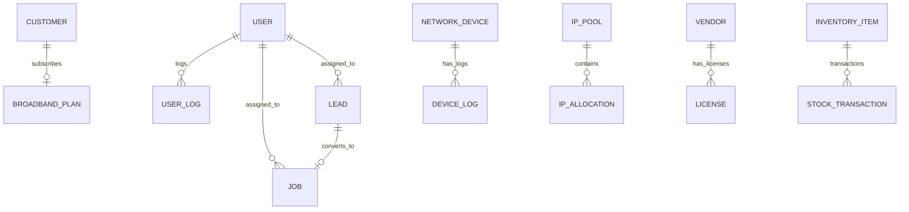

# Joitex Fiber - Database Schema Documentation

## Overview

The application uses **SQLAlchemy ORM** with a modular model structure organized by domain.

| Model File | Domain | Tables |
|------------|--------|--------|
| `models.py` | Core | User, Role, Lead, Customer, OLT, Product, UserLog |
| `models_network.py` | Network | NetworkDevice, IPPool, IPAllocation, NetworkIncident, DeviceLog |
| `models_inventory.py` | Inventory | InventoryItem, StockTransaction, StockRequest, Vendor |
| `models_job.py` | Jobs | Job |
| `models_finance.py` | Finance | Vendor, License |
| `models_sales.py` | Sales | BroadbandPlan |
| `models_service.py` | Service | ServiceTicket |

---

## Entity Relationship Diagram

---

## Core Tables (`models.py`)

### User
Primary user authentication and authorization table.

| Column | Type | Constraints | Description |
|--------|------|-------------|-------------|
| id | Integer | PK | Primary key |
| email | String(120) | UNIQUE, NOT NULL | Login email |
| password_hash | String(128) | | Bcrypt hashed password |
| name | String(100) | | Display name |
| role | String(50) | | Role: admin, engineer, network, etc. |
| permissions_json | Text | | JSON array of permissions |
| portals_json | Text | | JSON array of accessible portals |
| created_at | DateTime | | Account creation timestamp |
| last_login | DateTime | | Last login timestamp |
| last_logout | DateTime | | Last logout timestamp |
| last_seen | DateTime | | Last activity timestamp |
| is_active | Boolean | DEFAULT true | Account status |

### Role
Defines roles with their permissions.

| Column | Type | Constraints | Description |
|--------|------|-------------|-------------|
| id | Integer | PK | Primary key |
| name | String(50) | UNIQUE, NOT NULL | Role name |
| description | String(200) | | Role description |
| color | String(20) | DEFAULT '#1976d2' | UI display color |
| permissions_json | Text | | JSON permissions array |
| is_system | Boolean | DEFAULT false | System role flag |

### Lead
Sales leads tracking.

| Column | Type | Constraints | Description |
|--------|------|-------------|-------------|
| id | Integer | PK | Primary key |
| lead_number | String(20) | UNIQUE | Lead reference number |
| name | String(100) | | Lead name |
| email | String(120) | | Email address |
| phone | String(20) | | Phone number |
| address | Text | | Address |
| plan_interest | String(100) | | Interested plan |
| status | String(50) | DEFAULT 'new' | new, feasibility, in_progress, installed, cancelled |
| source | String(50) | DEFAULT 'manual' | manual, website, referral |
| assigned_to | Integer | FK → user.id | Assigned salesperson |
| follow_up_date | DateTime | | Next follow-up date |
| notes | Text | | Notes |
| created_at | DateTime | | Created timestamp |
| updated_at | DateTime | | Last updated |

### Customer
Registered customers.

| Column | Type | Constraints | Description |
|--------|------|-------------|-------------|
| id | Integer | PK | Primary key |
| customer_id | String(20) | UNIQUE, NOT NULL | Customer reference |
| name | String(100) | NOT NULL | Customer name |
| email | String(120) | UNIQUE | Email |
| phone | String(20) | NOT NULL | Phone |
| address | Text | | Address |
| plan_id | Integer | FK → broadband_plans.id | Subscribed plan |
| status | String(20) | DEFAULT 'active' | active, suspended, terminated |
| created_at | DateTime | | Created timestamp |

### UserLog
Audit trail for user actions.

| Column | Type | Constraints | Description |
|--------|------|-------------|-------------|
| id | Integer | PK | Primary key |
| user_id | Integer | FK → user.id, NOT NULL | User reference |
| action | String(50) | NOT NULL | login, logout, update, create, delete |
| details | Text | | Action details (JSON/text) |
| ip_address | String(50) | | Client IP |
| timestamp | DateTime | | Action timestamp |

---

## Network Tables (`models_network.py`)

### NetworkDevice
OLT and network equipment.

| Column | Type | Constraints | Description |
|--------|------|-------------|-------------|
| id | Integer | PK | Primary key |
| name | String(100) | NOT NULL | Device name |
| ip_address | String(20) | UNIQUE, NOT NULL | Management IP |
| device_type | String(50) | DEFAULT 'olt' | olt, switch, router |
| location | String(100) | | Physical location |
| status | String(20) | DEFAULT 'online' | online, offline, maintenance |
| uptime_days | Integer | DEFAULT 0 | Uptime in days |
| total_ports | Integer | DEFAULT 0 | Total port count |
| active_ports | Integer | DEFAULT 0 | Active ports |
| created_at | DateTime | | Created timestamp |

### IPPool
IP address pool management.

| Column | Type | Constraints | Description |
|--------|------|-------------|-------------|
| id | Integer | PK | Primary key |
| name | String(100) | NOT NULL | Pool name |
| cidr | String(50) | NOT NULL | CIDR notation (e.g., 192.168.1.0/24) |
| gateway | String(20) | | Gateway IP |
| type | String(20) | DEFAULT 'public' | public, private, management |
| total_ips | Integer | DEFAULT 0 | Total IPs in pool |
| used_ips | Integer | DEFAULT 0 | Used IPs count |
| description | Text | | Description |
| created_at | DateTime | | Created timestamp |

### IPAllocation
Individual IP address assignments.

| Column | Type | Constraints | Description |
|--------|------|-------------|-------------|
| id | Integer | PK | Primary key |
| pool_id | Integer | FK → ip_pools.id, NOT NULL | Parent pool |
| ip_address | String(20) | NOT NULL | Allocated IP |
| customer_name | String(100) | | Customer name |
| mac_address | String(50) | | Device MAC |
| assigned_at | DateTime | | Assignment date |
| status | String(20) | DEFAULT 'active' | active, released |

### NetworkIncident
Network incident tracking.

| Column | Type | Constraints | Description |
|--------|------|-------------|-------------|
| id | Integer | PK | Primary key |
| incident_number | String(50) | UNIQUE, NOT NULL | Incident reference |
| title | String(200) | NOT NULL | Incident title |
| severity | String(20) | NOT NULL | critical, major, minor |
| device_name | String(100) | | Affected device |
| description | Text | | Description |
| root_cause | Text | | Root cause analysis |
| status | String(20) | DEFAULT 'active' | active, investigating, resolved |
| started_at | DateTime | | Incident start |
| resolved_at | DateTime | | Resolution time |
| affected_count | Integer | DEFAULT 0 | Affected users count |

### DeviceLog
Device activity logs.

| Column | Type | Constraints | Description |
|--------|------|-------------|-------------|
| id | Integer | PK | Primary key |
| device_id | Integer | FK → network_devices.id, NOT NULL | Device reference |
| log_type | String(50) | DEFAULT 'info' | info, warning, error, system |
| message | Text | NOT NULL | Log message |
| created_at | DateTime | | Log timestamp |

---

## Inventory Tables (`models_inventory.py`)

### InventoryItem
Inventory catalog items.

| Column | Type | Constraints | Description |
|--------|------|-------------|-------------|
| id | Integer | PK | Primary key |
| sku | String(50) | UNIQUE, NOT NULL | Stock keeping unit |
| name | String(100) | NOT NULL | Item name |
| category | String(50) | NOT NULL | Category |
| description | Text | | Description |
| unit_price | Float | DEFAULT 0.0 | Unit cost |
| quantity | Integer | DEFAULT 0 | Current stock |
| min_stock_level | Integer | DEFAULT 10 | Reorder threshold |
| created_at | DateTime | | Created timestamp |
| updated_at | DateTime | | Last updated |

### StockTransaction
Inventory movements.

| Column | Type | Constraints | Description |
|--------|------|-------------|-------------|
| id | Integer | PK | Primary key |
| item_id | Integer | FK → inventory_items.id, NOT NULL | Item reference |
| transaction_type | String(20) | NOT NULL | in, out, return |
| quantity | Integer | NOT NULL | Transaction quantity |
| reference | String(100) | | Invoice/Job number |
| performed_by | String(100) | | User who performed |
| notes | Text | | Notes |
| created_at | DateTime | | Transaction timestamp |

### StockRequest
Engineer stock requests.

| Column | Type | Constraints | Description |
|--------|------|-------------|-------------|
| id | Integer | PK | Primary key |
| request_number | String(50) | UNIQUE, NOT NULL | Request reference |
| engineer_name | String(100) | NOT NULL | Requesting engineer |
| job_id | String(50) | | Related job |
| items_requested | Text | | JSON array of items |
| priority | String(20) | DEFAULT 'normal' | normal, urgent |
| status | String(20) | DEFAULT 'pending' | pending, approved, rejected |
| created_at | DateTime | | Request timestamp |

### Vendor (Inventory)
Inventory suppliers.

| Column | Type | Constraints | Description |
|--------|------|-------------|-------------|
| id | Integer | PK | Primary key |
| name | String(100) | NOT NULL | Vendor name |
| contact_person | String(100) | | Contact name |
| email | String(100) | | Email |
| phone | String(20) | | Phone |
| category | String(50) | | Vendor category |
| address | Text | | Address |
| status | String(20) | DEFAULT 'active' | active, inactive |
| created_at | DateTime | | Created timestamp |
| updated_at | DateTime | | Last updated |

---

## Job Tables (`models_job.py`)

### Job
Installation and service jobs.

| Column | Type | Constraints | Description |
|--------|------|-------------|-------------|
| id | Integer | PK | Primary key |
| job_number | String(20) | UNIQUE, NOT NULL | Job reference |
| customer_name | String(100) | NOT NULL | Customer name |
| phone | String(20) | NOT NULL | Customer phone |
| address | Text | NOT NULL | Installation address |
| city | String(50) | | City |
| job_type | String(50) | NOT NULL | New Install, Upgrade, Repair |
| plan | String(100) | | Selected plan |
| priority | String(20) | DEFAULT 'medium' | high, medium, low |
| status | String(20) | DEFAULT 'pending' | pending, in_progress, completed |
| scheduled_at | DateTime | NOT NULL | Scheduled date/time |
| started_at | DateTime | | Actual start time |
| completed_at | DateTime | | Completion time |
| notes | Text | | Notes |
| devices_json | Text | | JSON array of installed devices |
| engineer_id | Integer | FK → user.id | Assigned engineer |
| lead_id | Integer | FK → lead.id | Source lead |

---

## Finance Tables (`models_finance.py`)

### Vendor (Finance)
Financial vendors and service providers.

| Column | Type | Constraints | Description |
|--------|------|-------------|-------------|
| id | Integer | PK | Primary key |
| name | String(100) | NOT NULL | Vendor name |
| category | String(50) | NOT NULL | software, telecom, infrastructure, equipment |
| contact_person | String(100) | | Contact name |
| phone | String(20) | | Phone |
| email | String(100) | | Email |
| payment_terms | String(50) | | net15, net30, cod |
| address | Text | | Address |
| gst_number | String(50) | | GST number |
| pan_number | String(50) | | PAN number |
| monthly_cost | Float | DEFAULT 0.0 | Monthly expense |
| status | String(20) | DEFAULT 'active' | active, inactive, pending_payment |
| created_at | DateTime | | Created timestamp |

### License
Software and regulatory licenses.

| Column | Type | Constraints | Description |
|--------|------|-------------|-------------|
| id | Integer | PK | Primary key |
| name | String(100) | NOT NULL | License name |
| category | String(50) | NOT NULL | software, regulatory, telecom, infrastructure |
| license_number | String(100) | UNIQUE, NOT NULL | License number |
| vendor_id | Integer | FK → vendors.id, NOT NULL | Vendor reference |
| issue_date | Date | NOT NULL | Issue date |
| expiry_date | Date | NOT NULL | Expiry date |
| annual_cost | Float | DEFAULT 0.0 | Annual cost |
| status | String(20) | DEFAULT 'active' | active, expiring, expired |
| notes | Text | | Notes |
| created_at | DateTime | | Created timestamp |

---

## Sales Tables (`models_sales.py`)

### BroadbandPlan
Available broadband plans.

| Column | Type | Constraints | Description |
|--------|------|-------------|-------------|
| id | Integer | PK | Primary key |
| name | String(100) | NOT NULL | Plan name |
| speed_mbps | Integer | NOT NULL | Speed in Mbps |
| price_monthly | Float | NOT NULL | Monthly price |
| data_limit_gb | Integer | DEFAULT 0 | Data limit (0 = unlimited) |
| validity_days | Integer | DEFAULT 30 | Validity period |
| description | Text | | Description |
| is_active | Boolean | DEFAULT true | Active status |
| created_at | DateTime | | Created timestamp |

---

## Service Tables (`models_service.py`)

### ServiceTicket
Customer support tickets.

| Column | Type | Constraints | Description |
|--------|------|-------------|-------------|
| id | Integer | PK | Primary key |
| ticket_number | String(50) | UNIQUE, NOT NULL | Ticket reference |
| title | String(100) | NOT NULL | Ticket title |
| description | Text | | Issue description |
| priority | String(20) | DEFAULT 'medium' | low, medium, high |
| status | String(20) | DEFAULT 'open' | open, in_progress, resolved, closed |
| category | String(50) | | network, hardware, software, other |
| created_by_id | Integer | FK → user.id | Creator |
| engineer_name | String(100) | | Assigned engineer |
| created_at | DateTime | | Created timestamp |
| updated_at | DateTime | | Last updated |

---

## Table Count Summary

| Domain | Table Count |
|--------|-------------|
| Core | 7 |
| Network | 5 |
| Inventory | 4 |
| Job | 1 |
| Finance | 2 |
| Sales | 1 |
| Service | 1 |
| **Total** | **21** |

---

## Indexes & Constraints

### Unique Constraints
- `user.email`
- `lead.lead_number`
- `customer.customer_id`, `customer.email`
- `network_devices.ip_address`
- `job.job_number`
- `stock_requests.request_number`
- `network_incidents.incident_number`
- `licenses.license_number`
- `service_tickets.ticket_number`
- `roles.name`
- `inventory_items.sku`

### Foreign Key Relationships
- `lead.assigned_to` → `user.id`
- `customer.plan_id` → `broadband_plans.id`
- `job.engineer_id` → `user.id`
- `job.lead_id` → `lead.id`
- `ip_allocations.pool_id` → `ip_pools.id`
- `device_logs.device_id` → `network_devices.id`
- `licenses.vendor_id` → `vendors.id`
- `stock_transactions.item_id` → `inventory_items.id`
- `service_tickets.created_by_id` → `user.id`
- `user_logs.user_id` → `user.id`
